<p align="right">English | <a href="./README_CN.md">简体中文</a></p>  


<p align="center">
  
  
  <h3 align="center"><strong>Optimizing LiDAR Placements for Robust Driving Perception in Adverse Conditions</strong></h3>

  <p align="center">
      <a href="https://ywyeli.github.io/" target='_blank'>Ye Li</a><sup>1</sup>&nbsp;&nbsp;&nbsp;
      <a href="https://ldkong.com/" target='_blank'>Lingdong Kong</a><sup>2</sup>&nbsp;&nbsp;&nbsp;
      <a href="https://hanjianghu.net/" target='_blank'>Hanjiang Hu</a><sup>3</sup>&nbsp;&nbsp;&nbsp;
      <a href="https://scholar.google.com/citations?user=3Ifn2DoAAAAJ" target='_blank'>Xiaohao Xu</a><sup>1</sup>&nbsp;&nbsp;&nbsp;
      <a href="https://robotics.umich.edu/profile/xiaonan-sean-huang/" target='_blank'>Xiaonan Huang</a><sup>1</sup>
  <br />
  <sup>1</sup>University of Michigan, Ann Arbor&nbsp;&nbsp;&nbsp;
  <sup>2</sup>National University of Singapore&nbsp;&nbsp;&nbsp;
  <sup>3</sup>Carnegie Mellon University
  </p>

</p>

<p align="center">
  <a href="" target='_blank'>
    
  </a>
  
  <a href="" target='_blank'>
    
  </a>
  
  <a href="" target='_blank'>
    
  </a>
  
  <a href="" target='_blank'>
    
  </a>
  
  <a href="" target='_blank'>
    
  </a>
</p>


## About

The robustness of driving perception systems under unprecedented conditions is crucial for safety-critical usages. Latest advancements have prompted increasing interests towards multi-LiDAR perception. However, prevailing driving datasets predominantly utilize single-LiDAR systems and collect data devoid of adverse conditions, failing to capture the complexities of real-world environments accurately.

Addressing these gaps, we proposed `Place3D`, a full-cycle pipeline that encompasses LiDAR placement optimization, data generation, and downstream evaluations. Our framework makes three appealing contributions. 

- To identify the most effective configurations for multi-LiDAR systems, we introduce a Surrogate Metric of the Semantic Occupancy Grids (M-SOG) to evaluate LiDAR placement quality.
- Leveraging the M-SOG metric, we propose a novel optimization strategy to refine multi-LiDAR placements.
- Centered around the theme of multi-condition multi-LiDAR perception, we collect a 364,000-frame dataset from both clean and adverse conditions.

Extensive experiments demonstrate that LiDAR placements optimized using our approach outperform various baselines. We showcase exceptional robustness in both 3D object detection and LiDAR semantic segmentation tasks, under diverse adverse weather and sensor failure conditions.


| 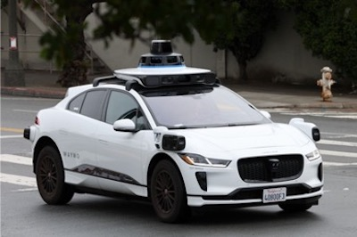 |  |  | 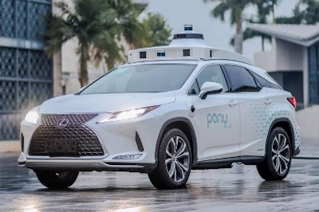 |
| :-: | :-: | :-: | :-: |
| Waymo | Motional | Cruise | Pony.ai |
| 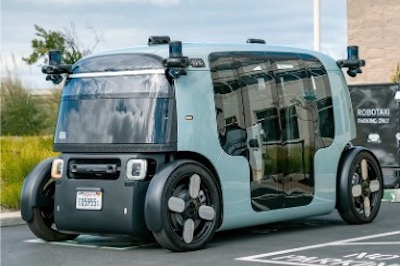 | 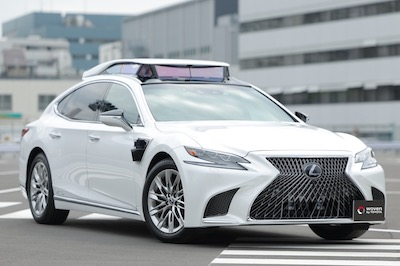 |  | 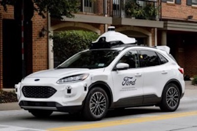
| Zoox | Toyota | Momenta | Ford | 

Visit our [project page]() to explore more examples. :blue_car:


## Updates

- \[2024.03\] - Our [paper]() is available on arXiv. The code has been made publicly accessible. :rocket:


## Outline

- [Installation](#gear-installation)
- [Data Preparation](#hotsprings-data-preparation)
- [Sensor Placement](#oncoming_automobile-sensor-placement)
- [Getting Started](#rocket-getting-started)
- [Model Zoo](#dragon-model-zoo)
- [Place3D Benchmark](#place3d-benchmark)
- [TODO List](#memo-todo-list)
- [Citation](#citation)
- [License](#license)
- [Acknowledgements](#acknowledgements)


## :gear: Installation

For details related to installation and environment setups, kindly refer to [INSTALL.md](docs/INSTALL.md).


## :hotsprings: Data Preparation

|  |  |  | 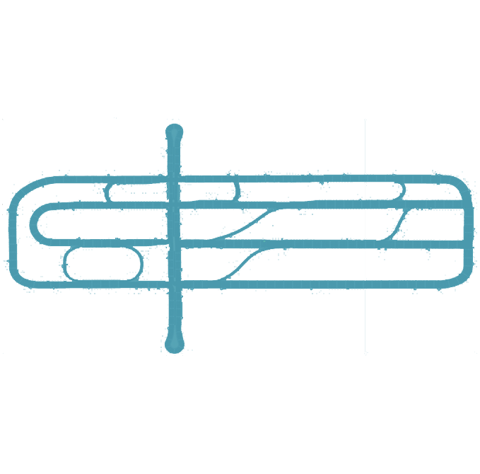
| :-: | :-: | :-: | :-: | 
| Town 1 | Town 3 | Town 4 | Town 6 |

Kindly refer to [DATA_PREPARE.md](docs/document/DATA_PREPARE.md) for the details to prepare the `Place3D` dataset.


## :oncoming_automobile: Sensor Placement

| 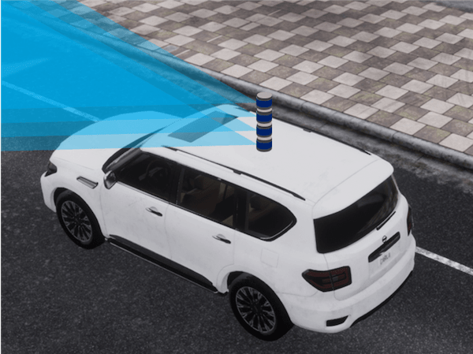 | 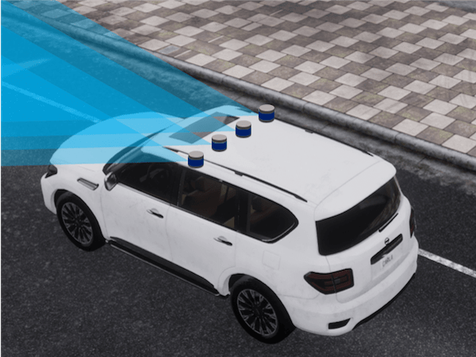 | 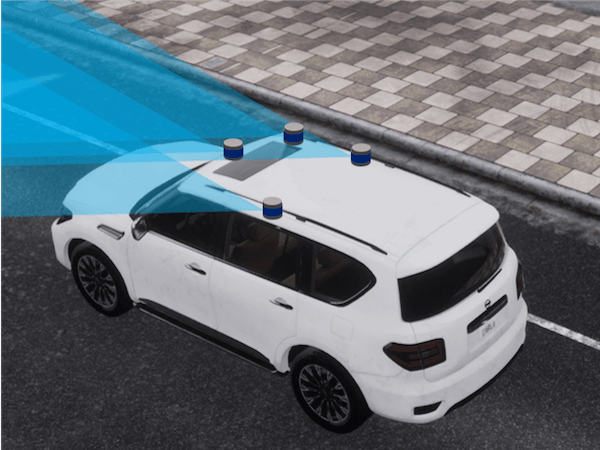 | 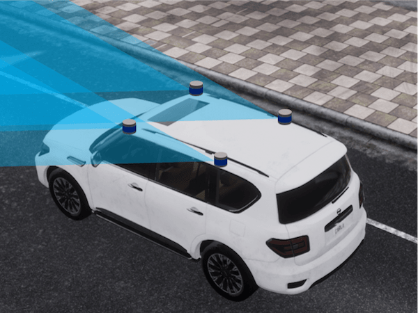 |
| :-: | :-: | :-: | :-: |
| Center | Line | Pyramid | Square |
| 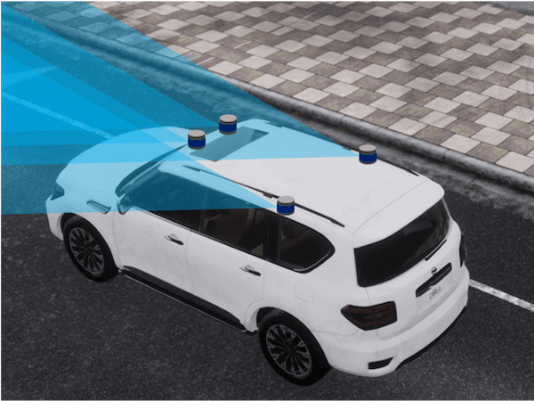 | 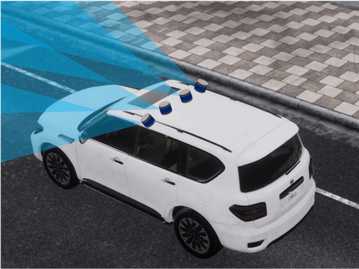 | 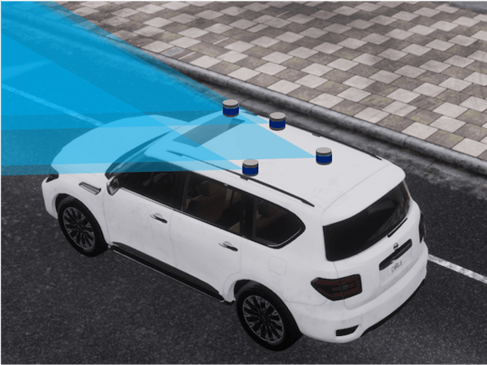 | 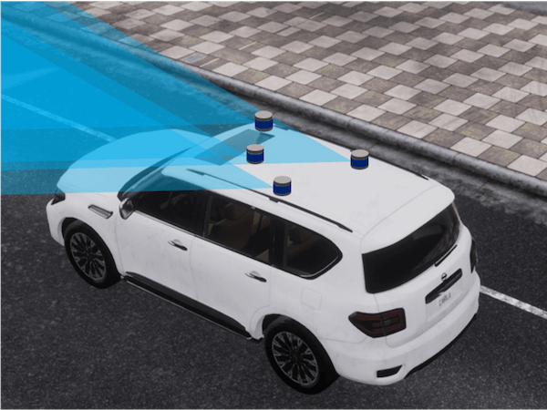
| Trapezoid | Line-Roll | Ours (Det) | Ours (Seg) | 


## :rocket: Getting Started

To learn more usage about this codebase, kindly refer to [GET_STARTED.md](docs/GET_STARTED.md).


## :dragon: Model Zoo

<details open>
<summary>&nbsp<b>LiDAR Semantic Segmentation</b></summary>

> - [x] **[MinkUNet](https://arxiv.org/abs/1904.08755), CVPR 2019.** <sup>[**`[Code]`**](https://github.com/NVIDIA/MinkowskiEngine)</sup>
> - [x] **[PolarNet](https://arxiv.org/abs/2003.14032), CVPR 2020.** <sup>[**`[Code]`**](https://github.com/edwardzhou130/PolarSeg)</sup>
> - [x] **[SPVCNN](https://arxiv.org/abs/2007.16100), ECCV 2020.** <sup>[**`[Code]`**](https://github.com/mit-han-lab/spvnas)</sup>
> - [x] **[Cylinder3D](https://arxiv.org/abs/2011.10033), CVPR 2021.** <sup>[**`[Code]`**](https://github.com/xinge008/Cylinder3D)</sup>

</details>

<details open>
<summary>&nbsp<b>3D Object Detection</b></summary>

> - [x] **[PointPillars](https://arxiv.org/abs/1812.05784), CVPR 2019.** <sup>[**`[Code]`**](https://github.com/nutonomy/second.pytorch)</sup>
> - [x] **[CenterPoint](https://arxiv.org/abs/2006.11275), CVPR 2021.** <sup>[**`[Code]`**](https://github.com/tianweiy/CenterPoint)</sup>
> - [x] **[BEVFusion](https://arxiv.org/abs/2205.13542), ICRA 2023.** <sup>[**`[Code]`**](https://github.com/mit-han-lab/bevfusion)</sup>
> - [x] **[FSTR](https://ieeexplore.ieee.org/document/10302363), TGRS 2023.** <sup>[**`[Code]`**](https://github.com/Poley97/FSTR)</sup>

</details>


## Place3D Benchmark

### LiDAR Semantic Segmentation

<table>
    <thead>
        <tr>
            <th rowspan="2">Method</th>
            <th colspan="3">Center</th>
            <th colspan="3">Line</th>
            <th colspan="3">Pyramid</th>
            <th colspan="3">Square</th>
        </tr>
        <tr>
            <th>mIoU</th><th>mAcc</th><th>ECE</th><th>mIoU</th><th>mAcc</th><th>ECE</th><th>mIoU</th><th>mAcc</th><th>ECE</th><th>mIoU</th><th>mAcc</th><th>ECE</th>
        </tr>
    </thead>
    <tbody>
        <tr>
            <td>MinkUNet</td>
            <td>65.7</td>
            <td>72.4</td>
            <td>0.041</td>
            <td>59.7</td>
            <td>67.7</td>
            <td>0.037</td>
            <td>62.7</td>
            <td>70.6</td>
            <td>0.072</td>
            <td>60.7</td>
            <td>68.4</td>
            <td>0.043</td>
        </tr>
        <tr>
            <td>PolarNet</td>
            <td>71.0</td>
            <td>76.0</td>
            <td>0.033</td>
            <td>67.7</td>
            <td>74.1</td>
            <td>0.034</td>
            <td>67.7</td>
            <td>73.0</td>
            <td>0.032</td>
            <td>69.3</td>
            <td>74.7</td>
            <td>0.033</td>
        </tr>
        <tr>
            <td>SPVCNN</td>
            <td>67.1</td>
            <td>74.4</td>
            <td>0.034</td>
            <td>59.3</td>
            <td>66.7</td>
            <td>0.068</td>
            <td>67.6</td>
            <td>74.0</td>
            <td>0.037</td>
            <td>63.4</td>
            <td>70.2</td>
            <td>0.031</td>
        </tr>
        <tr>
            <td>Cylinder3D</td>
            <td>72.7</td>
            <td>79.2</td>
            <td>0.041</td>
            <td>68.9</td>
            <td>76.3</td>
            <td>0.045</td>
            <td>68.4</td>
            <td>76.0</td>
            <td>0.093</td>
            <td>69.9</td>
            <td>76.7</td>
            <td>0.044</td>
        </tr>
        <tr>
            <td><strong>Average</strong></span></td>
            <td>69.1</td>
            <td>75.5</td>
            <td>0.037</td>
            <td>63.9</td>
            <td>71.2</td>
            <td>0.046</td>
            <td>66.6</td>
            <td>73.4</td>
            <td>0.059</td>
            <td>65.8</td>
            <td>72.5</td>
            <td>0.038</td>
        </tr>
    </tbody>
    <tfoot>
        <tr>
            <th rowspan="2">Method</th>
            <th colspan="3">Trapezoid</th>
            <th colspan="3">Line-Roll</th>
            <th colspan="3">Pyramid-Roll</th>
            <th colspan="3">Ours</th>
        </tr>
        <tr>
            <th>mIoU</th><th>mAcc</th><th>ECE</th><th>mIoU</th><th>mAcc</th><th>ECE</th><th>mIoU</th><th>mAcc</th><th>ECE</th><th>mIoU</th><th>mAcc</th><th>ECE</th>
        </tr>
        <tr>
            <td>MinkUNet</td>
            <td>59.0</td>
            <td>66.2</td>
            <td>0.040</td>
            <td>58.5</td>
            <td>66.4</td>
            <td>0.047</td>
            <td>62.2</td>
            <td>69.6</td>
            <td>0.051</td>
            <td>66.5</td>
            <td>73.2</td>
            <td>0.031</td>
        </tr>
        <tr>
            <td>PolarNet</td>
            <td>66.8</td>
            <td>72.3</td>
            <td>0.034</td>
            <td>67.2</td>
            <td>72.8</td>
            <td>0.037</td>
            <td>70.9</td>
            <td>75.9</td>
            <td>0.035</td>
            <td>76.7</td>
            <td>81.5</td>
            <td>0.033</td>
        </tr>
        <tr>
            <td>SPVCNN</td>
            <td>61.0</td>
            <td>68.8</td>
            <td>0.044</td>
            <td>60.6</td>
            <td>68.0</td>
            <td>0.034</td>
            <td>67.9</td>
            <td>74.2</td>
            <td>0.033</td>
            <td>68.3</td>
            <td>74.6</td>
            <td>0.034</td>
        </tr>
        <tr>
            <td>Cylinder3D</td>
            <td>68.5</td>
            <td>75.4</td>
            <td>0.057</td>
            <td>69.8</td>
            <td>77.0</td>
            <td>0.048</td>
            <td>69.3</td>
            <td>77.0</td>
            <td>0.048</td>
            <td>73.0</td>
            <td>78.9</td>
            <td>0.037</td>
        </tr>
        <tr class="highlight">
            <td><strong>Average</strong></td>
            <td>63.8</td>
            <td>70.7</td>
            <td>0.044</td>
            <td>64.0</td>
            <td>71.1</td>
            <td>0.042</td>
            <td>67.6</td>
            <td>74.2</td>
            <td>0.042</td>
            <td>71.1</td>
            <td>77.1</td>
            <td>0.034</td>
        </tr>
    </tfoot>
</table>

### 3D Object Detection


## :memo: TODO List
- [x] Initial release. 🚀
- [x] Add LiDAR placement benchmarks.
- [x] Add LiDAR placement datasets.
- [x] Add acknowledgments.
- [x] Add citations.
- [ ] Add more 3D perception models.


## Citation
If you find this work helpful for your research, please kindly consider citing our papers:

```bibtex
@article{li2024place3d,
    author = {Ye Li and Lingdong Kong and Hanjiang Hu and Xiaohao Xu and Xiaonan Huang},
    title = {Optimizing LiDAR Placements for Robust Driving Perception in Adverse Conditions},
    journal = {arXiv preprint arXiv:2403.},
    year = {2024},
}
```
```bibtex
@misc{mmdet3d,
    title = {MMDetection3D: OpenMMLab Next-Generation Platform for General 3D Object Detection},
    author = {MMDetection3D Contributors},
    howpublished = {\url{https://github.com/open-mmlab/mmdetection3d}},
    year = {2020}
}
```


## License

This work is under the <a rel="license" href="https://www.apache.org/licenses/LICENSE-2.0">Apache License Version 2.0</a>, while some specific implementations in this codebase might be with other licenses. Kindly refer to [LICENSE.md](docs/LICENSE.md) for a more careful check, if you are using our code for commercial matters.


## Acknowledgements

This work is developed based on the [MMDetection3D](https://github.com/open-mmlab/mmdetection3d) codebase.

> <br>
> MMDetection3D is an open-source toolbox based on PyTorch, towards the next-generation platform for general 3D perception. It is a part of the OpenMMLab project developed by MMLab.

We acknowledge the use of the following public resources, during the course of this work: <sup>1</sup>[CARLA](https://github.com/carla-simulator/carla), <sup>2</sup>[nuScenes-devkit](https://github.com/nutonomy/nuscenes-devkit), <sup>3</sup>[SemanticKITTI-API](), <sup>4</sup>[MinkowskiEngine](https://github.com/NVIDIA/MinkowskiEngine), <sup>5</sup>[TorchSparse](https://github.com/mit-han-lab/torchsparse), <sup>6</sup>[Open3D-ML](https://github.com/isl-org/Open3D-ML), and <sup>7</sup>[Robo3D](https://github.com/ldkong1205/Robo3D).

We thank the exceptional contributions from the above open-source repositories! :heart:


