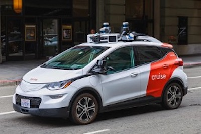

<p align="right">English | <a href="./README_CN.md">简体中文</a></p>  


<p align="center">
  
  
  <h3 align="center"><strong>Optimizing LiDAR Placements for Robust Driving Perception in Adverse Conditions</strong></h3>

  <p align="center">
      <a href="https://xiangxu-0103.github.io/" target='_blank'>Ye Li</a><sup>1</sup>&nbsp;&nbsp;&nbsp;
      <a href="https://ldkong.com/" target='_blank'>Lingdong Kong</a><sup>2</sup>&nbsp;&nbsp;&nbsp;
      <a href="" target='_blank'>Hanjiang Hu</a><sup>3</sup>&nbsp;&nbsp;&nbsp;
      <a href="" target='_blank'>Xiaohao Xu</a><sup>1</sup>&nbsp;&nbsp;&nbsp;
      <a href="" target='_blank'>Xiaonan Huang</a><sup>1</sup>
  <br />
  <sup>1</sup>University of Michigan, Ann Arbor&nbsp;&nbsp;&nbsp;
  <sup>2</sup>National University of Singapore&nbsp;&nbsp;&nbsp;
  <sup>3</sup>Carnegie Mellon University
  </p>

</p>

<p align="center">
  <a href="" target='_blank'>
    
  </a>
  
  <a href="" target='_blank'>
    
  </a>
  
  <a href="" target='_blank'>
    
  </a>
  
  <a href="" target='_blank'>
    
  </a>
  
  <a href="" target='_blank'>
    
  </a>
</p>


## About

To be added.


|  |  |  |  |
| :-: | :-: | :-: | :-: |
| Waymo | Motional | Cruise | Pony.ai |
|  |  |  | 
| Zoox | Toyota | Momenta | Ford | 

Visit our [project page]() to explore more examples. :blue_car:


## Updates

- \[2024.03\] - Our [paper]() is available on arXiv. The code has been made publicly accessible. :rocket:


## Outline

- [Installation](#gear-installation)
- [Data Preparation](#hotsprings-data-preparation)
- [Sensor Placement](#oncoming_automobile-sensor-placement)
- [Getting Started](#rocket-getting-started)
- [Model Zoo](#dragon-model-zoo)
- [Place3D Benchmark](#place3d-benchmark)
- [TODO List](#memo-todo-list)
- [Citation](#citation)
- [License](#license)
- [Acknowledgements](#acknowledgements)


## :gear: Installation

For details related to installation and environment setups, kindly refer to [INSTALL.md](docs/INSTALL.md).


## :hotsprings: Data Preparation

Kindly refer to [DATA_PREPARE.md](docs/document/DATA_PREPARE.md) for the details to prepare the Place3D dataset.


## :oncoming_automobile: Sensor Placement

|  |  |  |  |
| :-: | :-: | :-: | :-: |
| Center | Line | Pyramid | Square |
|  |  |  | 
| Trapezoid | Line-Roll | Ours (Det) | Ours (Seg) | 


## :rocket: Getting Started

To learn more usage about this codebase, kindly refer to [GET_STARTED.md](docs/GET_STARTED.md).


## :dragon: Model Zoo

<details open>
<summary>&nbsp<b>LiDAR Semantic Segmentation</b></summary>

> - [x] **[MinkUNet](https://arxiv.org/abs/1904.08755), CVPR 2019.** <sup>[**`[Code]`**](https://github.com/NVIDIA/MinkowskiEngine)</sup>
> - [x] **[PolarNet](https://arxiv.org/abs/2003.14032), CVPR 2020.** <sup>[**`[Code]`**](https://github.com/edwardzhou130/PolarSeg)</sup>
> - [x] **[SPVCNN](https://arxiv.org/abs/2007.16100), ECCV 2020.** <sup>[**`[Code]`**](https://github.com/mit-han-lab/spvnas)</sup>
> - [x] **[Cylinder3D](https://arxiv.org/abs/2011.10033), CVPR 2021.** <sup>[**`[Code]`**](https://github.com/xinge008/Cylinder3D)</sup>

</details>

<details open>
<summary>&nbsp<b>3D Object Detection</b></summary>

> - [x] **[PointPillars](https://arxiv.org/abs/1812.05784), CVPR 2019.** <sup>[**`[Code]`**](https://github.com/nutonomy/second.pytorch)</sup>
> - [x] **[CenterPoint](https://arxiv.org/abs/2006.11275), CVPR 2021.** <sup>[**`[Code]`**](https://github.com/tianweiy/CenterPoint)</sup>
> - [x] **[BEVFusion](https://arxiv.org/abs/2205.13542), ICRA 2023.** <sup>[**`[Code]`**](https://github.com/mit-han-lab/bevfusion)</sup>
> - [x] **[FSTR](https://ieeexplore.ieee.org/document/10302363), TGRS 2023.** <sup>[**`[Code]`**](https://github.com/Poley97/FSTR)</sup>

</details>


## Place3D Benchmark

To be added.


## :memo: TODO List
- [x] Initial release. 🚀
- [x] Add LiDAR placement benchmarks.
- [x] Add LiDAR placement datasets.
- [x] Add acknowledgments.
- [x] Add citations.
- [ ] Add more 3D perception models.


## Citation
If you find this work helpful for your research, please kindly consider citing our papers:

```bibtex
@article{li2024place3d,
    author = {Ye Li and Lingdong Kong and Hanjiang Hu and Xiaohao Xu and Xiaonan Huang},
    title = {Optimizing LiDAR Placements for Robust Driving Perception in Adverse Conditions},
    journal = {arXiv preprint arXiv:2403.},
    year = {2024},
}
```
```bibtex
@misc{mmdet3d,
    title = {MMDetection3D: OpenMMLab Next-Generation Platform for General 3D Object Detection},
    author = {MMDetection3D Contributors},
    howpublished = {\url{https://github.com/open-mmlab/mmdetection3d}},
    year = {2020}
}
```


## License

> <br>
> This work is under the <a rel="license" href="https://www.apache.org/licenses/LICENSE-2.0">Apache License Version 2.0</a>, while some specific operations in this codebase might be with other licenses.

Kindly refer to [LICENSE.md](docs/LICENSE.md) for a more careful check, if you are using our code for commercial matters.


## Acknowledgements

This work is developed based on the [MMDetection3D](https://github.com/open-mmlab/mmdetection3d) codebase.

> <br>
> MMDetection3D is an open-source toolbox based on PyTorch, towards the next-generation platform for general 3D perception. It is a part of the OpenMMLab project developed by MMLab.

We acknowledge the use of the following public resources, during the course of this work: 

We thank the exceptional contributions from the above open-source repositories! :heart:


